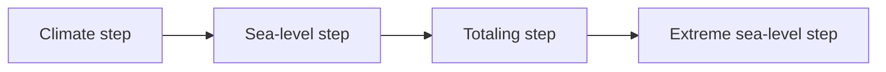

# FACTS2: Framework for Assessing Changes To Sea level 2

:construction: *THIS README IS A WORK IN PROGRESS* :construction:

FACTS2 is an open-source software ecosystem that provides a unified framework for computing and examining projections of global mean, regional, and extreme sea-level change and its uncertainties. It is designed so users can easily explore deep uncertainty by producing and comparing multiple probability distributions that represent different choices of contributing processes. FACTS2 is a refactoring of the original [`facts`](https://github.com/radical-collaboration/facts) ([Kopp et al. 2023](https://doi.org/10.5194/gmd-16-7461-2023)) codebase into a more loosely coupled set of scientific modules and framework software.


## Table of Contents

- [Overview](#overview)
  - [Climate step](#climate-step)
  - [Sea-level step](#sea-level-step)
  - [Totaling step](#totaling-step)
  - [Extreme sea-level step](#extreme-sea-level-step)
- [FACTS-Experiment-Builder (FEB)](#facts-experiment-builder-feb)
- [Module details](#module-details)
  - [Climate step](#climate-step-1)
  - [Sea-level step](#sea-level-step-1)
    - [Vertical land motion](#vertical-land-motion)
    - [Land ice (ice sheets and glaciers)](#land-ice-ice-sheets-and-glaciers)
    - [Thermal expansion and ocean dynamics](#thermal-expansion-and-ocean-dynamics)
    - [Land water storage](#land-water-storage)
  - [Totaling step](#totaling-step-1)
  - [Extreme sea-level step](#extreme-sea-level-step-1)
  - [Framework](#framework)
- [Getting started](#getting-started)
- [References](#references)

## Overview

FACTS2 is made up of a suite of independent, command-line applications (or, "modules") that can be executed directly using `uv` or using `docker run` to run inside its accompanying Docker container (recommended). Each module application is a GitHub repository and includes a README with instructions for accessing input data and running the module, and includes a working example. Links to the modules are listed in the [Module details](#module-details) section below.

Typically, researchers link these modules together in specific ways to estimate distributions of sea level change. The linked modules, known as a FACTS "experiment", follow a set of steps that are run in sequence: 
  **1. climate step:** produce global mean surface temperature (GMST) change and other relevant climate variables to drive sea level components
  **2. sea-level step:** produce sea-level change contributions from modules (run in parallel) representing:
    - i. vertical land motion
    - ii. land ice (ice sheets and glaciers)
    - iii. thermal expansion and ocean dynamics
    - iv. land water storage
  **3. totaling step:** produce total global and relative sea level change by summing outputs of step 2. Structural uncertainty can be explored by summing different components in separate "workflows"
  **4. extreme sea-level step:** compute return levels and other extreme sea-level statistics from totaled sea-level projections and historical tide-gauge data



Sea-level modules within step 2 run in parallel; all later steps depend on earlier ones completing successfully.

FACTS2 experiments are defined using YAML configuration files and can be hand-written or generated with [`facts-experiment-builder`](https://github.com/fact-sealevel/facts-experiment-builder) (FEB). Pre-configured experiments—including configurations used in IPCC AR6—are available in the [`facts-experiment-catalog`](https://github.com/fact-sealevel/facts-experiment-catalog).

### Climate step

The first step in an experiment. A climate module produces global mean surface temperature (GMST) and other climate variables from an emissions scenario (e.g. `ssp585`). Output is written to NetCDF and consumed by sea-level modules that require climate forcing. You can also supply your own climate data and skip this step.

Available modules: see [Module details → Climate step](#climate-step-1).

### Sea-level step

The second step. One or more sea-level modules run in parallel if compute resources allow, each computing a physical contribution to future sea-level change: glaciers, land ice, ocean sterodynamics, vertical land motion, and land water storage. Modules are independent of one another but may depend on climate-step output. Multiple module choices for the same process let you explore **structural uncertainty** (different scientific models for the same physics).

Available modules: see [Module details → Sea-level step](#sea-level-step-1).

### Totaling step

The third step. The [`facts-total`](https://github.com/fact-sealevel/facts-total) module sums sea-level contributions from the modules in each **workflow**, producing global-mean and location-specific total sea-level projections. Defining multiple workflows—each with a different combination of sea-level modules—is the primary way to compare alternative model configurations within one experiment.

Available modules: see [Module details → Totaling step](#totaling-step-1).

### Extreme sea-level step

The fourth and optional step. An extreme sea-level module takes totaled local sea-level projections and historical tide-gauge data to estimate return levels and other extreme sea-level statistics at coastal locations. This step characterizes extreme events rather than mean sea-level change alone.

Available modules: see [Module details → Extreme sea-level step](#extreme-sea-level-step-1).

## FACTS-Experiment-Builder (FEB)

[`facts-experiment-builder`](https://github.com/fact-sealevel/facts-experiment-builder) (FEB) is the command-line tool for configuring and running FACTS2 experiments. It reads module definitions from the [`facts-module-registry`](https://github.com/fact-sealevel/facts-module-registry) and produces the YAML files needed to execute an experiment with Docker Compose.

| Command | Purpose |
|---------|---------|
| `feb init` | Initialize a workspace and clone the module registry |
| `feb setup-experiment` | Select modules and write `experiment-config.yaml` |
| `feb generate-compose` | Generate `experiment-compose.yaml` from a completed config |
| `feb check-data` | Verify that required module input files are present |
| `feb list-modules` | List all modules available in your local registry |

**Documentation:**
- [FEB README](https://github.com/fact-sealevel/facts-experiment-builder/blob/main/README.md) — installation and end-to-end example
- [Quickstart guide](https://github.com/fact-sealevel/facts-experiment-builder/blob/main/docs/QUICKSTART.md) — workspace setup and input data downloads
- [FACTS glossary](https://github.com/fact-sealevel/facts-experiment-builder/blob/main/docs/FACTS_GLOSSARY.md) — key terms (experiments, workflows, module types)
- [Experiment config overview](https://github.com/fact-sealevel/facts-experiment-builder/blob/main/docs/EXPERIMENT-CONFIG-OVERVIEW.md) — anatomy of `experiment-config.yaml`

> FEB is under active development. Check the repository for the latest release notes and breaking changes.

## Module details

Most experiment steps have multiple module options from which to choose. Each links to the module's GitHub repository and README.

### Climate step
- [`fair-temperature`](https://github.com/fact-sealevel/fair-temperature)
- [`fair2-climate`](https://github.com/fact-sealevel/fair2-climate)

### Sea-level step

#### Vertical land motion
- [`kopp14-verticallandmotion`](https://github.com/fact-sealevel/kopp14-verticallandmotion)
- [`nzinsargps-verticallandmotion`](https://github.com/fact-sealevel/nzinsargps-verticallandmotion)
- [`oelsmann24-verticallandmotion`](https://github.com/fact-sealevel/oelsmann24-verticallandmotion)
- [`caron18-gia`](https://github.com/fact-sealevel/caron18-gia)

#### Land ice (ice sheets and glaciers)
- [`bamber19-icesheets`](https://github.com/fact-sealevel/bamber19-icesheets)
- [`deconto21-ais`](https://github.com/fact-sealevel/deconto21-ais)
- [`fittedismip-gris`](https://github.com/fact-sealevel/fittedismip-gris)
- [`larmip-ais`](https://github.com/fact-sealevel/larmip-ais)
- [`emulandice-ais`](https://github.com/fact-sealevel/emulandice)
- [`emulandice-glaciers`](https://github.com/fact-sealevel/emulandice)
- [`emulandice-gris`](https://github.com/fact-sealevel/emulandice)
- [`emulandice2-ais`](https://github.com/fact-sealevel/emulandice2)
- [`emulandice2-gis`](https://github.com/fact-sealevel/emulandice2)
- [`emulandice2-glaciers`](https://github.com/fact-sealevel/emulandice2)
- [`ipccar5-glaciers`](https://github.com/fact-sealevel/ipccar5)
- [`ipccar5-icesheets`](https://github.com/fact-sealevel/ipccar5)

#### Thermal expansion and ocean dynamics
- [`tlm-sterodynamics`](https://github.com/fact-sealevel/tlm-sterodynamics)
- [`ebm3-sterodynamics`](https://github.com/fact-sealevel/ebm3-sterodynamics)

#### Land water storage
- [`ssp-landwaterstorage`](https://github.com/fact-sealevel/ssp-landwaterstorage)

### Totaling step
- [`facts-total`](https://github.com/fact-sealevel/facts-total)

### Extreme sea-level step
- [`extremesealevel-pointsoverthreshold`](https://github.com/fact-sealevel/extremesealevel-pointsoverthreshold)
- [`extremesealevel2-AFs`](https://github.com/fact-sealevel/extremesealevel2-AFs)

### Framework
- [`facts-experiment-builder`](https://github.com/fact-sealevel/facts-experiment-builder)
- [`facts-module-registry`](https://github.com/fact-sealevel/facts-module-registry)
- [`facts-experiment-catalog`](https://github.com/fact-sealevel/facts-experiment-catalog)

## Getting started

A minimal path from zero to a running experiment:

1. **Install prerequisites** — [Docker](https://docs.docker.com/get-started/get-docker/) and [uv](https://docs.astral.sh/uv/) (to run FEB without a separate install).
2. **Run FEB** — use `uvx` to invoke `facts-experiment-builder` on demand; no install required:
   ```shell
   uvx --from git+https://github.com/fact-sealevel/facts-experiment-builder@main feb <command>
   ```
   Optionally run `uv tool install git+https://github.com/fact-sealevel/facts-experiment-builder@main` if you prefer a permanent `feb` command.
3. **Initialize a workspace** — `feb init` (creates `experiments/` and clones the module registry).
4. **Download input data** — follow the [Quickstart guide](https://github.com/fact-sealevel/facts-experiment-builder/blob/main/docs/QUICKSTART.md), then run `feb check-data` to confirm files are in place.
5. **Configure an experiment** — `feb setup-experiment` with your chosen modules, scenario, and projection years.
6. **Generate and run** — `feb generate-compose --experiment-name <name>`, then `docker compose -f experiments/<name>/experiment-compose.yaml up`.

   Steps 3–6 use `feb` for brevity; prefix with `uvx --from git+https://github.com/fact-sealevel/facts-experiment-builder@main` if you did not install FEB.

Each module repository linked in [Module details](#module-details) has its own README with module-specific input data links and standalone usage examples. For a pre-built IPCC AR6 configuration, browse the [`facts-experiment-catalog`](https://github.com/fact-sealevel/facts-experiment-catalog).

Questions or issues? Open an issue in the relevant module repository or in [`facts-experiment-builder`](https://github.com/fact-sealevel/facts-experiment-builder/issues).

## References

For the original FACTS description paper, see [Kopp, R. E., Garner, G. G., Hermans, T. H. J., Jha, S., Kumar, P., Reedy, A., Slangen, A. B. A., Turilli, M., Edwards, T. L., Gregory, J. M., Koubbe, G., Levermann, A., Merzky, A., Nowicki, S., Palmer, M. D., & Smith, C. (2023). The Framework for Assessing Changes To Sea-Level (FACTS) v1.0: A platform for characterizing parametric and structural uncertainty in future global, relative, and extreme sea-level change. Geoscientific Model Development, 16, 7461–7489](https://doi.org/10.5194/gmd-16-7461-2023).

FACTS2 modules are open source under the MIT license unless otherwise noted in individual repositories.
